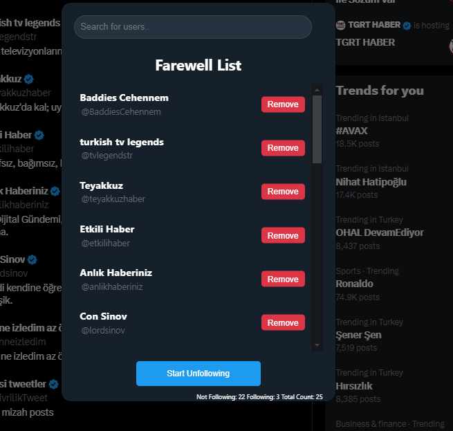

### Twitter Unfollower Extension

This is a Chrome extension that helps you unfollow multiple Twitter accounts at once. You can choose the accounts you want to unfollow from your following list, and then click a button to unfollow them in bulk. This is useful if you want to declutter your Twitter feed and remove unwanted or inactive accounts.

## Features

- Unfollow several accounts at once from your following list
- Filter accounts by name, username
- Preview the accounts you are about to unfollow
- Select which users to unfollow

## Installation

To install this extension, you need to download the source code from this repo and load it as an unpacked extension in Chrome. Follow these steps:

1. Click the green “Code” button on this page and select “Download ZIP”.
2. Extract the ZIP file to a folder on your computer.
3. Open Chrome and go to chrome://extensions.
4. Turn on the “Developer mode” switch on the top right corner.
5. Click the “Load unpacked” button and select the folder where you extracted the ZIP file.
   You should see the extension icon on your browser toolbar.

Clone the Repository:

Clone this repository to your local machine using git clone https://github.com/username/repository.git.
Navigate to the Directory:
Change to the directory where you cloned the repository:
bash
Copy code
cd repository

## Usage

To use this extension, you need to log in to your Twitter account and go to your following list. You can access your following list by clicking your profile icon on the top right corner and selecting “Following”. Or, you can go to https://twitter.com/<your_username>/following.

Once you are on your following list, you can:

- Select the accounts you want to unfollow by clicking the checkboxes next to their names.
- Filter the accounts by name, username, bio, or verified status using the search box on the top left corner.
- Sort the accounts by date followed, followers, or following using the dropdown menu on the top right corner.
- Preview the accounts you are about to unfollow by clicking the “Preview” button on the bottom left corner.
- Unfollow the selected accounts by clicking the “Unfollow Selected” button on the bottom right corner.
- Undo your last unfollow action by clicking the “Undo” button on the bottom right corner.

## User Interface

